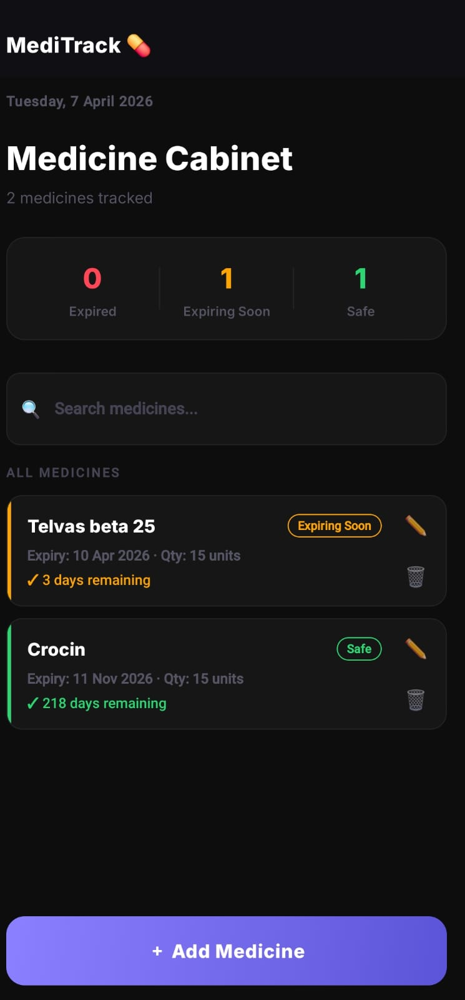
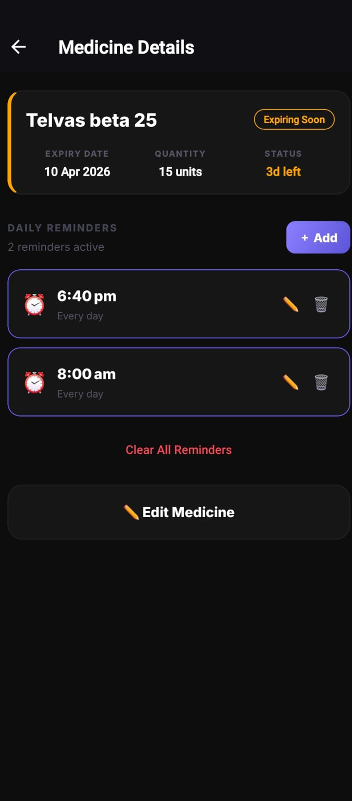
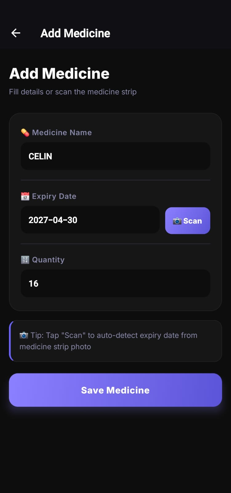

<div align="center">
  <h1>MediTrack 💊</h1>
  <p>A smart, AI-powered medicine cabinet tracker built with React Native and Expo.</p>
</div>

<br/>

## ✨ Features

- **AI-Powered Vision Scanning:** Skip the typing. Snap a picture of your medicine's blister pack, and Google's flagship **Gemini 2.5 Flash Vision API** instantly parses the drug name, exact expiry date, and remaining pill quantity directly from the medicine strip or packaging.
- **Intelligent Reminders:** Highly reliable, locally-scheduled background notifications ensure you never miss a daily dose. Automated timeline alerts warn you exactly when your stash is about to expire.
- **Premium UX Design:** A fully customized dark-mode interface built to feel like top-tier tech. Features deep dual-tone gradients, custom `Inter` typography, haptic engine feedback, and fluid layout animations that smoothly slide lists as items are modified.
- **Privacy First Storage:** No remote medical databases. All of your medicine tracking data is securely bound locally on-device.

## 📸 Screenshots


| Home Screen | Medicine Details | Scanning AI |
|:---:|:---:|:---:|
|  |  |  |

## 📱 How to Use

1. **Adding a Medicine:** 
   - Tap the **`+ Add Medicine`** button on the Home Screen.
   - Tap **`Scan`** to open your camera. Frame the reflective blister pack wrapper so the text is visible.
   - The AI will automatically fill in the medicine name, true expiry date, and the number of pills remaining!
2. **Managing Your Cabinet:** 
   - Your Home Screen will sort your medicines by their Expiry Status (Safe, Expiring Soon, or Expired).
   - Use the Search Bar to instantly filter through your medical cabinet.
3. **Setting Daily Reminders:**
   - Tap on any active medicine card to open the **Medicine Details** tab.
   - Under *Daily Reminders*, tap **`+ Add`** to open the time picker.
   - Select a time, and the app will natively schedule a repeating daily push notification to remind you to take that specific drug!

## 🚀 Tech Stack

- **Framework:** React Native / Expo
- **AI Brain:** Google Gemini 2.5 Flash (via REST)
- **Local Persistence:** `@react-native-async-storage`
- **Background Processes:** `expo-notifications` (Custom Android `HIGH` Importance Channels)
- **Styling Pipeline:** Vanilla StyleSheet, `expo-linear-gradient`, `@expo-google-fonts`

## 📦 Setup & Installation

To run this project locally, you will need Node.js and the Expo CLI installed.

1. **Clone the repository:**
   ```bash
   git clone https://github.com/Hardikkhanduja/MediTrack
   cd MediTrack
   ```

2. **Install dependencies:**
   ```bash
   npm install
   ```

3. **Configure Environment Variables:**
   Create a `.env` file in the root directory and securely add your Gemini API key. *(Note: This file is strictly excluded from version control for your safety).*
   ```env
   EXPO_PUBLIC_GEMINI_API_KEY=your_google_gemini_key_here
   ```

4. **Launch Application Dev Server:**
   ```bash
   npx expo start -c
   ```

## 🏗️ Production Builds (Android .APK)

Because `.env` files are correctly blocked by Git, this project uses Expo Application Services (EAS) secured cloud secrets to inject the API key strictly during the compile process.

1. Upload your API key into your Expo project's secure and encrypted locker:
   ```bash
   eas secret:create --scope project --name EXPO_PUBLIC_GEMINI_API_KEY --value your_api_key_here --type string
   ```
2. Trigger the cloud builder to generate a standalone Android build:
   ```bash
   eas build -p android --profile preview
   ```

---
<div align="center">
  <i>Developed for seamless health tracking.</i>
</div>
