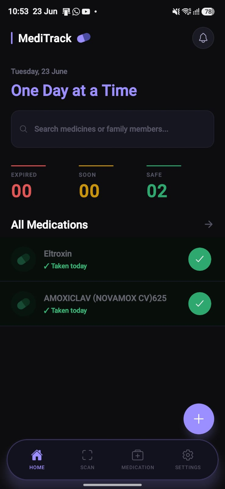
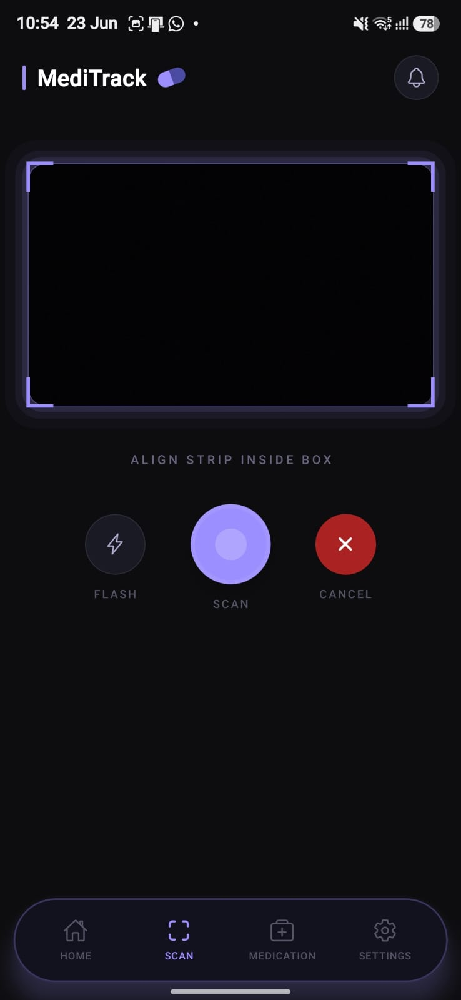
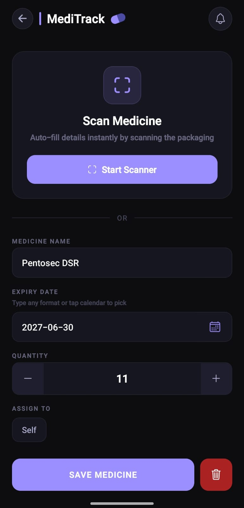
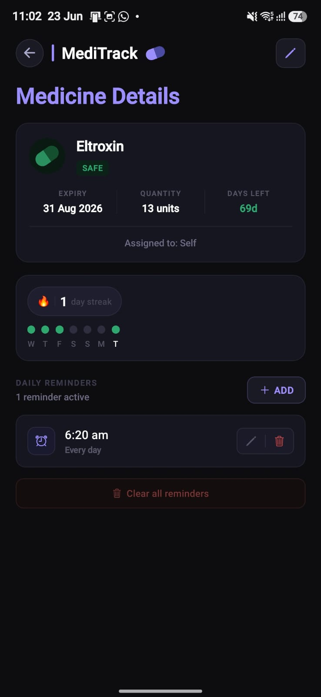
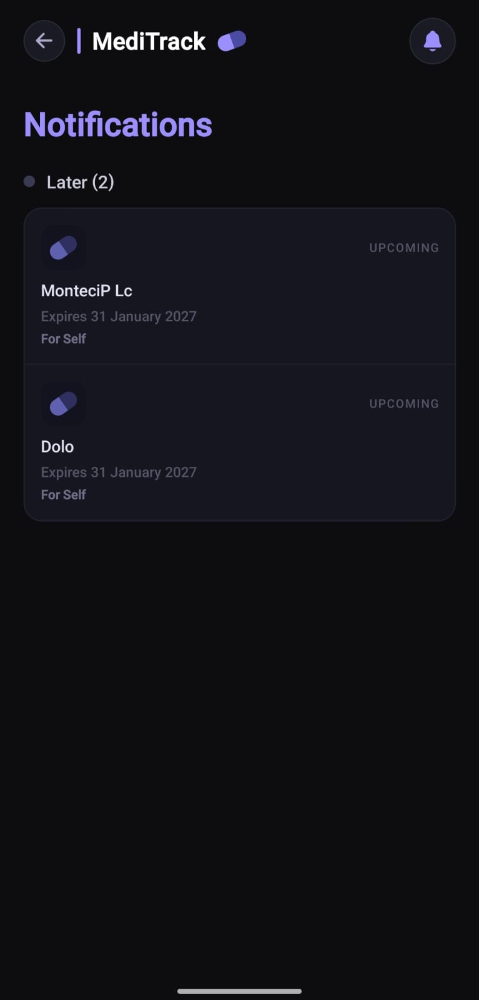
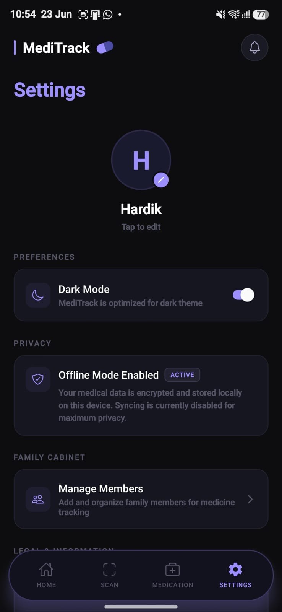

<div align="center">

# 💊 MediTrack

### AI-Powered Family Medicine Reminder & Expiry Tracker

Never miss a dose. Never forget an expiry date.

MediTrack helps individuals and families organize medicines, receive daily medication reminders, track expiry dates, and instantly scan medicine strips using AI-powered vision technology.

Built with React Native, Expo, and Google Gemini 2.5 Flash Vision.


</div>

---

## Overview

Most households store medicines for multiple family members, making it difficult to:

- Track who takes which medicine
- Remember daily doses
- Monitor expiry dates
- Keep medicine cabinets organized
- Avoid using expired medications

MediTrack simplifies medicine management through AI-powered medicine scanning, daily reminders, expiry tracking, and family medicine organization—all in a clean, privacy-focused mobile experience.

---

## Features

### AI-Powered Medicine Scanner

Skip manual entry.

Simply scan a medicine strip or package, and Google Gemini Vision automatically extracts:

- Medicine Name
- Expiry Date
- Quantity Remaining

This makes adding medicines fast, accurate, and effortless.

---

### Family Medicine Management

Organize medicines for different family members from a single application.

Keep medicines, reminders, and expiry tracking structured and easy to manage for the entire household.

---

### Daily Medication Reminders

Create personalized reminder schedules for each medicine.

Receive reliable local notifications even when the application is closed, helping ensure medications are taken on time.

---

### Expiry Date Tracking

Stay ahead of medicine expiries with automated alerts:

- 30 Days Before Expiry
- 7 Days Before Expiry
- 1 Day Before Expiry

Never accidentally use expired medication again.

---

### Medication Progress Tracking

Track medicine consumption using an intuitive weekly progress view.

Quickly see whether scheduled doses were taken and maintain consistency in daily medication routines.

---

### Smart Search & Organization

Instantly search medicines and organize them by status:

- Safe
- Expiring Soon
- Expired

Find medicines quickly and maintain a well-organized medicine cabinet.

---

### Privacy-First Design

Your data remains on your device.

- No account required
- No cloud database
- No unnecessary data collection

Your medicine information stays private.

---

## Screenshots

### Home Screen | AI Scanner | AI Autofill

| Home                                           | AI Scanner                                     | AI Autofill                                |
| ---------------------------------------------- | ---------------------------------------------- | ------------------------------------------------- |
|  |  |  |

### Details | Notifications | Settings

| Details                                         | Notifications                                           | Settings                               |
| -------------------------------------------------- | ------------------------------------------------------- | -------------------------------------------------- |
|  |  |  |

---

## How It Works

### 1. Add a Medicine

Choose one of two methods:

- Manual Entry
- AI Scan

---

### 2. Scan Using AI

Capture a clear image of the medicine strip or packaging.

Gemini Vision automatically identifies and extracts medicine details.

---

### 3. Assign to a Family Member

Store medicines under the correct family member to keep records organized and easy to manage.

---

### 4. Set Daily Reminders

Add one or multiple reminder times.

MediTrack schedules local notifications to help ensure medications are taken on time.

---

### 5. Monitor Expiry Dates

The application continuously tracks expiry dates and sends alerts before medicines expire.

---

## Tech Stack

### Mobile Development

- React Native
- Expo

### Artificial Intelligence

- Google Gemini 2.5 Flash Vision API

### Local Storage

- @react-native-async-storage/async-storage

### Notifications

- Expo Notifications

### UI & Design

- React Native StyleSheet
- Expo Vector Icons
- Google Fonts (Inter)

---

## Installation

### Clone the Repository

```bash
git clone https://github.com/Hardikkhanduja/MediTrack.git

cd MediTrack
```

### Install Dependencies

```bash
npm install
```

### Configure Environment Variables

Create a `.env` file in the project root:

```env
EXPO_PUBLIC_GEMINI_API_KEY=YOUR_API_KEY
```

### Start the Development Server

```bash
npx expo start
```

---

## Android Build

### Configure EAS Secret

```bash
eas secret:create \
--scope project \
--name EXPO_PUBLIC_GEMINI_API_KEY \
--value YOUR_API_KEY \
--type string
```

### Generate Android Build

```bash
eas build -p android
```

---

## Project Structure

```text
MediTrack
├── assets/
├── components/
├── screens/
├── services/
├── utils/
├── storage/
├── App.js
├── app.json
└── package.json
```

---

## Roadmap

Planned improvements:

- Low Stock Alerts
- Medicine Refill Tracking
- Light Theme Support
- Data Backup & Restore
- Improved AI Recognition Accuracy
- Enhanced Family Management Features
- Medication History Analytics

---

## Why MediTrack?

MediTrack combines intelligent medicine scanning, family medicine organization, reminder scheduling, and expiry tracking into a single mobile application.

Instead of managing medicines manually, users can maintain an organized digital medicine cabinet and receive timely reminders while keeping their data private and stored locally.

---


## License

This project is licensed under the MIT License. See the LICENSE file for details.

---


## Developer

**Hardik Khanduja**  
Computer Science Engineering Student  
Full Stack Developer • AI Enthusiast • Mobile App Developer  

GitHub: https://github.com/Hardikkhanduja
---

<div align="center">

If you find this project useful, consider giving it a ⭐ on GitHub.

Built to help individuals and families manage medicines with confidence.

</div>
